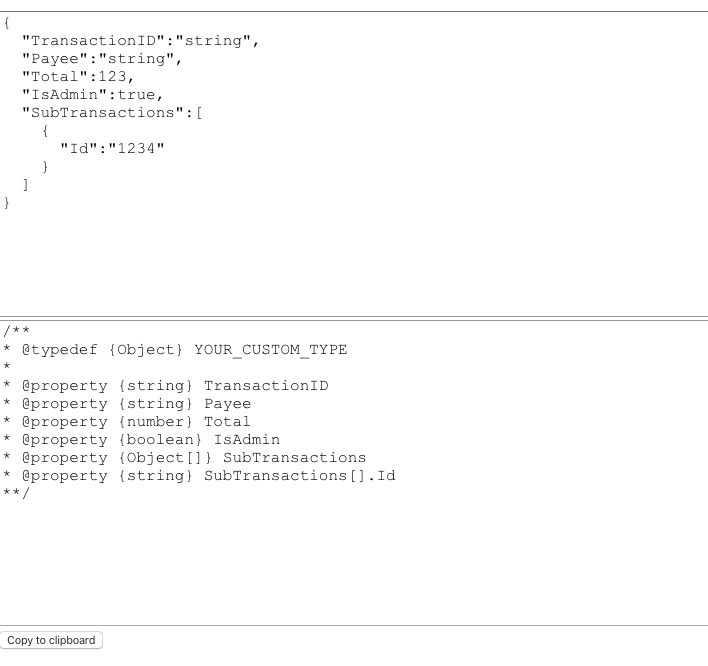

# Generate JSDoc typedefs from JSON objects
This small React app can generate a JSDoc typedef based on a JSON object.



Run this app using the following command <br>
```npm i && npm start```

## Important
When an array is found, the structure of items is based on the first element.<br>

